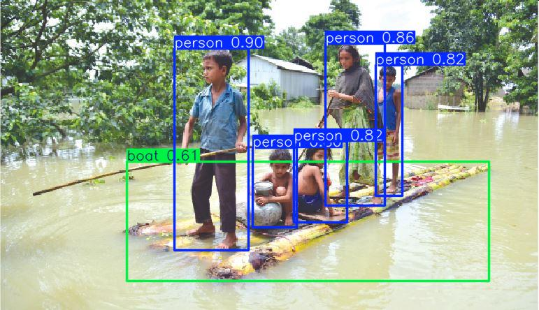
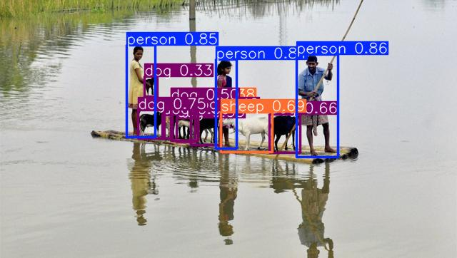
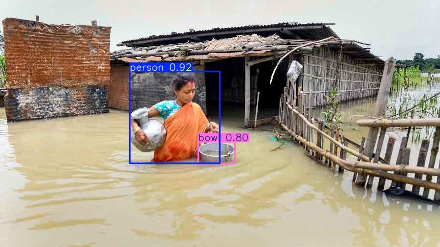
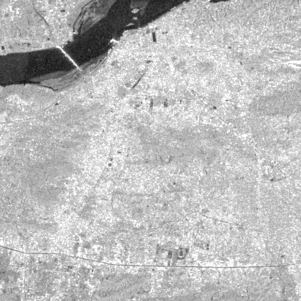
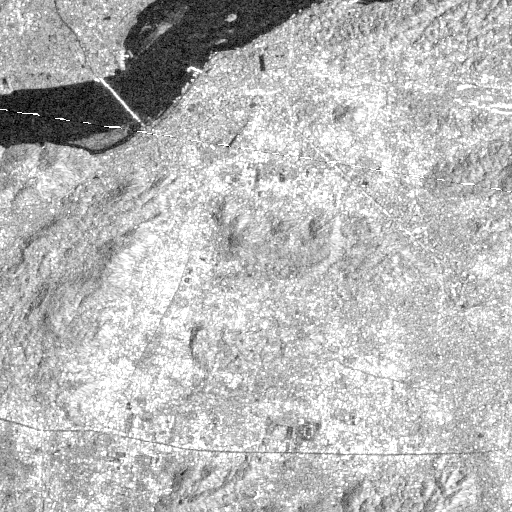
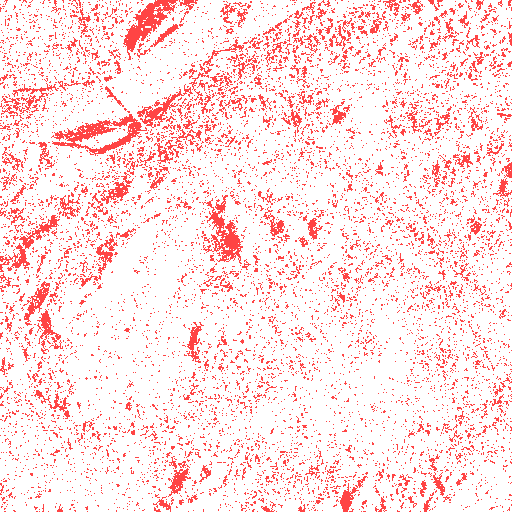

<p align="center">
  <h1 align="center">🌊 Jalbhumi Raksha</h1>
  <p align="center"><strong>AI-Powered Flood Detection & Government Compensation Verification System</strong></p>
  <p align="center">
    Satellite intelligence cross-validates community-reported damage — making relief faster, fairer, and fraud-proof across rural India.
  </p>
</p>

---

## 🎯 What is Jalbhumi Raksha?

Jalbhumi Raksha is an end-to-end flood relief system that uses **dual AI verification** (satellite + ground photos) to ensure fair, fast, and fraud-proof government compensation for flood-affected farmers in India.

### How It Works

```
📱 Gaon Bura captures photos  →  🤖 YOLOv8 classifies damage (Score 0-50)
                                                    ↓
🛰️ Sentinel-1 SAR confirms flood  →  🧠 SegFormer maps extent (Score 0-50)
                                                    ↓
                                    📊 Total Score = Ground + Satellite (0-100)
                                                    ↓
                    ≥75: Auto-Approved  │  55-74: Officer Review  │  <35: Rejected
                                                    ↓
                                    💰 NDRF compensation → PFMS DBT to bank
```

---

## 🏗️ Project Structure

```
Jalbhumi Raksha/
├── flood_relief_system.html     # Original project specification
├── docker-compose.yml           # PostgreSQL + Redis + API
├── .env.example                 # Environment configuration template
│
├── backend/                     # FastAPI Python backend
│   ├── main.py                  # Application entry point
│   ├── config.py                # Pydantic settings (from .env)
│   ├── database.py              # Async SQLAlchemy + PostGIS
│   ├── requirements.txt         # Python dependencies
│   ├── Dockerfile
│   │
│   ├── core/                    # AI/ML processing modules
│   │   ├── flood_detector.py    # YOLOv8 ground photo analysis
│   │   ├── sar_processor.py     # Sentinel-1 SAR flood mapping (GEE)
│   │   ├── verification_engine.py # Score fusion + claim routing
│   │   ├── compensation.py      # NDRF rate-based calculator
│   │   └── fraud_detector.py    # 6-layer anti-fraud engine
│   │
│   ├── models/                  # Data models
│   │   ├── db_models.py         # SQLAlchemy ORM (PostGIS geometry)
│   │   └── schemas.py           # Pydantic request/response schemas
│   │
│   ├── api/                     # API layer
│   │   ├── dependencies.py      # Auth, JWT, dependency injection
│   │   └── routes/
│   │       ├── health.py        # Health check + rate tables
│   │       ├── claims.py        # Claim submission + status
│   │       └── officer.py       # Officer dashboard endpoints
│   │
│   ├── services/                # External integrations
│   │   ├── sms_service.py       # MSG91 / Twilio SMS
│   │   ├── storage_service.py   # Photo file storage
│   │   └── pfms_service.py      # Govt payment system (DBT)
│   │
│   └── utils/                   # Helpers
│       ├── geo_utils.py         # Haversine, point-in-polygon
│       └── image_utils.py       # EXIF extraction, resize
│
├── dashboard/                   # Next.js officer dashboard (coming soon)
├── mobile/                      # Flutter Gaon Bura app (coming soon)
├── models/                      # Trained ML model weights
└── data/                        # Datasets & shapefiles
```

---

## 🔍 Dual-Verification in Action (Real Claim: `CLM-71A0BCD8`)

Jalbhumi Raksha's primary strength lies in its ability to cross-reference ground-level photos with satellite radar data. Below is a real-world verification result generated by the system.

### 1. Ground Analysis (YOLOv8)
The system identifies flood markers and crop damage from Gaon Bura phone photos, extracting metadata for fraud prevention.

| Detection #1 | Detection #2 | Detection #3 |
|:---:|:---:|:---:|
|  |  |  |
| *Score: 45/50 (Flood Confirmed)* | *Score: 30/50 (Partial Flood)* | *Score: 45/50 (Flood Confirmed)* |

### 2. Satellite SAR Verification (Sentinel-1)
Even under 100% cloud cover, the SAR radar detects standing water by measuring the drop in backscatter.

| Pre-Flood Baseline | Post-Flood Radar | Flood Change Mask |
|:---:|:---:|:---:|
|  |  |  |
| *Normal ground signal* | *Dark areas = water* | **RED = Validated Flood Area** |

> **Final Verification Score:** `87/100` — **AUTO-APPROVED** for PFMS Disbursement.

---

## ⚡ Quick Start

### Prerequisites
- Python 3.11+
- Docker & Docker Compose (for PostgreSQL + Redis)

### 1. Clone & Setup

```bash
git clone <repo-url>
cd "Flood Detection"

# Copy environment config
cp .env.example .env
```

### 2. Start Infrastructure

```bash
# Start PostgreSQL (PostGIS) + Redis
docker-compose up -d db redis
```

### 3. Run Backend

```bash
cd backend

# Create virtual environment
python -m venv venv
venv\Scripts\activate        # Windows
# source venv/bin/activate   # Linux/Mac

# Install dependencies (core only, skip ML for quick start)
pip install fastapi uvicorn[standard] pydantic pydantic-settings python-multipart
pip install sqlalchemy asyncpg geoalchemy2 alembic
pip install aiofiles httpx python-jose[cryptography] passlib[bcrypt]
pip install loguru python-dotenv redis Pillow exifread

# Run the server
uvicorn main:app --reload --port 8000
```

### 4. Test the API

```bash
# Health check
curl http://localhost:8000/api/v1/health

# View docs
open http://localhost:8000/docs

# Get compensation rates
curl http://localhost:8000/api/v1/rates
```

---

## 🔌 API Endpoints

| Method | Endpoint | Description |
|--------|----------|-------------|
| `GET` | `/api/v1/health` | System health check |
| `GET` | `/api/v1/info` | App capabilities |
| `GET` | `/api/v1/rates` | NDRF compensation rate tables |
| `POST` | `/api/v1/claims/submit` | Submit flood claim with photos |
| `GET` | `/api/v1/claims/{id}` | Check claim status |
| `POST` | `/api/v1/officer/login` | Officer JWT login |
| `GET` | `/api/v1/officer/pending` | Get pending claims |
| `POST` | `/api/v1/officer/approve` | Bulk approve claims |
| `POST` | `/api/v1/officer/reject/{id}` | Reject a claim |
| `GET` | `/api/v1/officer/stats` | District statistics |

---

## 🤖 AI Models

| Model | Architecture | Purpose | Input | Output |
|-------|-------------|---------|-------|--------|
| Ground Classifier | YOLOv8m | Phone photo flood detection | RGB 640px | Class + Score (0-50) |
| SAR Flood Mapper | SegFormer-B4 | Satellite flood extent | Sentinel-1 VV/VH | GeoTIFF mask + Score (0-50) |
| Shared Backbone | ResNet-50 | Multi-modal fusion | Both | Combined features |

### Mock Mode
The backend runs without ML models in **mock mode** — it generates realistic-looking scores for development. Just start the server without placing model weights.

---

## 🔐 Verification Scoring

```
Total Score = Ground Score (0–50) + Satellite Score (0–50)

≥75 → AUTO_APPROVED      → DBT payment in 48h
55–74 → OFFICER_REVIEW   → District officer spot-check (48h)
35–54 → FIELD_VERIFICATION → Patwari/Tehsildar field visit
<35 → REJECTED           → SMS with reason code
```

### Anti-Fraud Layers
1. **Photo Fraud** — Perceptual hash duplicate detection
2. **GPS Spoofing** — Coordinates vs village polygon (±500m)
3. **Beneficiary Dedup** — One Aadhaar per event per season
4. **Statistical Anomaly** — Village Z-score analysis
5. **Blockchain Audit** — Hyperledger immutable trail
6. **Temporal Consistency** — SAR timestamps as ground truth

---

## 💰 Compensation Rates (NDRF 2023)

| Category | Rate |
|----------|------|
| Paddy/Wheat (rainfed) | ₹6,800/ha |
| Paddy (irrigated) | ₹13,500/ha |
| Sugarcane/Perennial | ₹18,000/ha |
| Pucca house (full damage) | ₹95,100 |
| Kutcha house | ₹3,200 |

**Formula**: `area × rate × damage% × state_multiplier`

---

## 🛠️ Tech Stack

| Layer | Technology |
|-------|-----------|
| **Backend** | FastAPI, Python 3.11, SQLAlchemy |
| **Database** | PostgreSQL 16 + PostGIS 3.4 |
| **Cache** | Redis 7 |
| **AI/ML** | PyTorch, YOLOv8, SegFormer, OpenCV |
| **Satellite** | Google Earth Engine, Sentinel-1/2 |
| **Payments** | PFMS API (Govt DBT) |
| **SMS** | MSG91 / Twilio |
| **Dashboard** | Next.js (planned) |
| **Mobile** | Flutter (planned) |
| **Infra** | Docker, Docker Compose |

---

## 📄 License

This project is developed for disaster relief purposes.

---

<p align="center">
  <strong>Jalbhumi Raksha</strong> — Making flood relief faster, fairer, and fraud-proof 🌊
</p>
